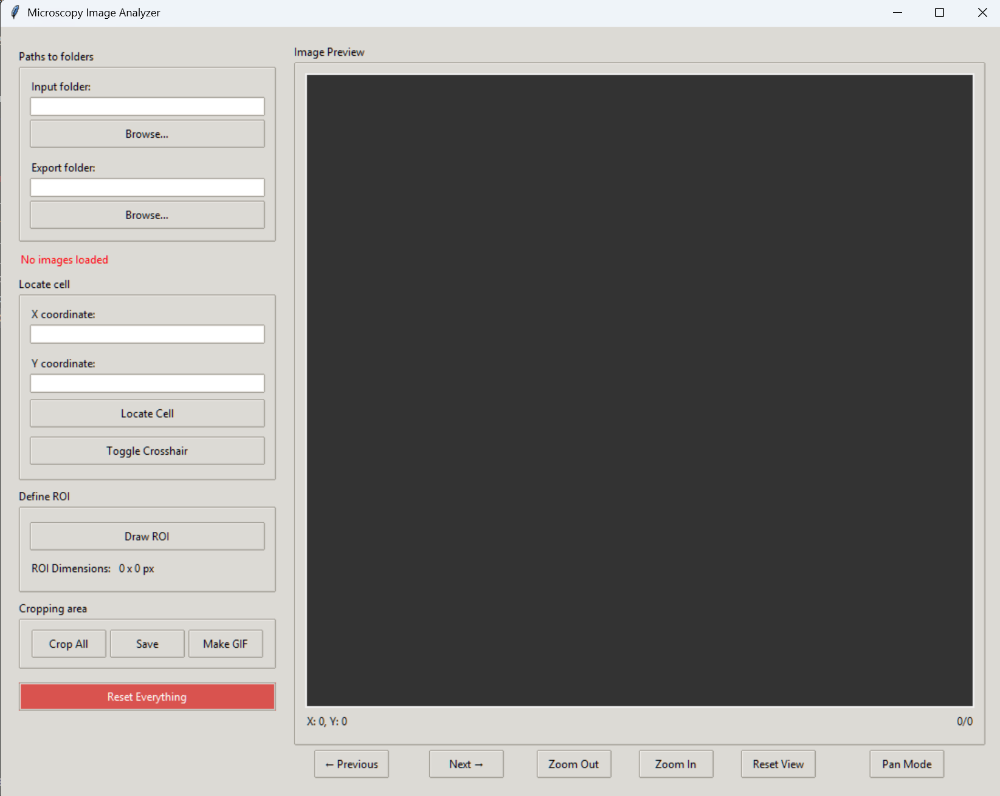

# Microscopy Image Analyzer

A comprehensive GUI application for analyzing microscopy timeframe images, designed for researchers working with time-series microscopy data.

## Application Preview



*The main interface of the Microscopy Image Analyzer showing the image viewer, ROI drawing tools, and control panels*

## Application of this App

This application was specifically developed for researchers preparing microscopy images for scientific publications and manuscripts. The primary workflow addresses a common challenge in cell biology research: tracking individual cells across time-series microscopy data and presenting clean, publication-ready images. The app enables researchers to load original microscopy timeframe images, define precise regions of interest (ROI) around target cells or cellular structures, and systematically crop all images in the sequence to maintain consistent framing throughout the time series. This ensures that tracked cells remain centered and properly framed across all timepoints, which is crucial for demonstrating cellular processes, migration patterns, or morphological changes over time. The cropped images can be directly used in manuscript figures, maintaining high quality and consistent presentation standards required for scientific publications. Additionally, the built-in GIF generation feature allows researchers to create animated sequences that effectively demonstrate dynamic cellular processes, providing reviewers and readers with an intuitive visualization of temporal changes. This eliminates the need for multiple software tools and manual image processing, streamlining the workflow from raw microscopy data to publication-ready figures and supplementary animations.

## Features

- **Image Sequence Loading**: Load and navigate through multiple timeframe images
- **Interactive ROI Definition**: Draw, resize, and move regions of interest
- **Cell Location**: Locate and center on specific cell coordinates
- **Batch Processing**: Crop all images in a sequence using the defined ROI
- **Animation Creation**: Generate animated GIFs from cropped image sequences
- **Zoom and Pan**: Interactive image viewing with zoom and pan capabilities
- **Export Functionality**: Save cropped images and create animations

## Installation

### Prerequisites

- Python 3.7 or higher
- tkinter (usually included with Python)

### Required Packages

Install the required packages using pip:

```bash
pip install -r requirements.txt
```

Or install individually:

```bash
pip install Pillow numpy imageio
```

## Usage

### Running the Application

```bash
python main_app.py
```

### Basic Workflow

1. **Load Images**: Click "Browse..." next to "Input folder" to select a folder containing your timeframe images
2. **Set Export Folder**: Click "Browse..." next to "Export folder" to choose where to save results
3. **Navigate Images**: Use "Previous" and "Next" buttons to browse through your image sequence
4. **Locate Cell** (Optional): Enter X,Y coordinates to center the view on a specific cell
5. **Define ROI**: Click "Draw ROI" and drag to create a region of interest
6. **Crop Images**: Click "Crop All" to process all images with the defined ROI
7. **Save Results**: Use "Save" to export cropped images or "Make GIF" to create an animation

### Application Interface Overview

The application interface consists of several key components:

- **Main Image Viewer**: Central canvas displaying your microscopy images with zoom and pan capabilities
- **Control Panel** (Left): 
  - File browser buttons for input/output folders
  - Image navigation controls (Previous/Next)
  - Cell location input fields (X, Y coordinates)
- **Tools Panel** (Right):
  - ROI drawing and management tools
  - Zoom controls (In/Out/Reset)
  - Processing buttons (Crop All, Save, Make GIF)
  - Pan mode toggle
- **Status Information**: Current image details and ROI coordinates
- **Menu Bar**: Access to additional features and settings

### Controls

#### Image Navigation
- **Previous/Next**: Navigate through image sequence
- **Zoom In/Out**: Zoom the current view
- **Reset View**: Return to default zoom and position
- **Pan Mode**: Toggle pan mode for moving the view

#### ROI Management
- **Draw ROI**: Enter drawing mode to create a new ROI
- **Resize Handles**: Drag corner handles to resize the ROI
- **Move ROI**: Drag the ROI rectangle to reposition it

#### Mouse Controls
- **Mouse Wheel**: Zoom in/out at mouse position
- **Left Click + Drag**: Draw ROI (in draw mode) or move ROI (in edit mode)
- **Right Click**: Context menu for ROI operations (planned feature)

## Project Structure

```
microscopy_analyzer/
├── src/
│   ├── core/
│   │   ├── image_processor.py    # Core image processing logic
│   │   └── roi_manager.py        # ROI handling and interaction
│   ├── gui/
│   │   ├── main_window.py        # Main application window
│   │   └── components.py         # GUI components
│   ├── utils/
│   │   ├── file_utils.py         # File handling utilities
│   │   └── image_utils.py        # Image processing utilities
│   └── app.py                    # Main application controller
├── config/
│   └── settings.py               # Configuration settings
├── tests/                        # Unit tests (planned)
├── import/                       # Default input folder
├── export/                       # Default output folder
├── main_app.py                   # Application entry point
├── requirements.txt              # Python dependencies
└── README.md                     # This file
```

## Supported Image Formats

- JPEG (.jpg, .jpeg)
- PNG (.png)
- TIFF (.tif, .tiff)
- BMP (.bmp)
- GIF (.gif)

## Configuration

The application can be configured by modifying `config/settings.py`:

- **Window dimensions**: Adjust `WINDOW_WIDTH` and `WINDOW_HEIGHT`
- **Canvas size**: Modify `CANVAS_WIDTH` and `CANVAS_HEIGHT`
- **Zoom limits**: Change `MAX_ZOOM` and `MIN_ZOOM`
- **ROI appearance**: Customize `ROI_COLOR`, `LINE_WIDTH`, etc.
- **Supported formats**: Add or remove file extensions

## Development

### Code Organization

The application follows a modular architecture:

- **Core Logic** (`src/core/`): Image processing and ROI management
- **GUI Components** (`src/gui/`): User interface elements
- **Application Controller** (`src/app.py`): Coordinates between GUI and core logic
- **Utilities** (`src/utils/`): Helper functions for common tasks
- **Configuration** (`config/`): Centralized settings management

### Key Design Principles

- **Separation of Concerns**: Clear separation between GUI, business logic, and utilities
- **Modularity**: Each component has a specific responsibility
- **Extensibility**: Easy to add new features and image processing capabilities
- **Configuration**: Centralized configuration for easy customization

### Adding New Features

1. **New Image Processing**: Add functions to `src/core/image_processor.py`
2. **New GUI Elements**: Create components in `src/gui/components.py`
3. **New Utilities**: Add helper functions to appropriate utility modules
4. **Configuration**: Add new settings to `config/settings.py`

## Future Enhancements

- **Advanced Image Processing**: Integration with scikit-image and OpenCV
- **Batch Analysis**: Statistical analysis of cropped regions
- **Plugin System**: Support for custom image processing plugins
- **Database Integration**: Store and retrieve analysis results
- **Machine Learning**: Automated cell detection and tracking
- **Multi-format Export**: Support for additional output formats
- **Undo/Redo**: Action history for ROI operations

## Troubleshooting

### Common Issues

1. **Import Errors**: Ensure all required packages are installed
2. **Image Loading Problems**: Verify image formats are supported
3. **Performance Issues**: Try reducing image size or zoom level
4. **Memory Errors**: Close and restart the application if processing large images

### Error Reporting

If you encounter bugs or issues:

1. Note the exact error message
2. Record the steps to reproduce the problem
3. Check the console output for detailed error information
4. Verify all dependencies are correctly installed

## License

[Add your license information here]

## Contributing

I developed this application entirely on my own to support and accelerate my research workflow. From designing the interface to implementing core functionalities, every part of the app was built by me with a clear focus on solving practical challenges in my scientific analysis. It was designed specifically to handle and process microscopy timeframes efficiently, helping me present timeseries images in scientific papers easily and save alot of time. 


## Contact

Muhammad Sinan profile: https://www.ippt.pan.pl/en/staff/?osoba=msinan